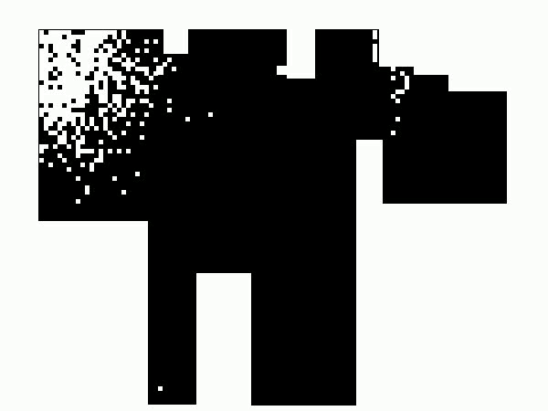

# RoomBot

RoomBot is a cheap vacuum robot (25€) I upgraded for knowledge and _profit_.

## Robot v1
The robot drives around randomly by design and cannot be steered. Since my flat is small it randomly drives everywhere in a reasonable amount of time anyway, so this is not an issue. To guarantee it gets everywhere the battery was upgraded. Another problem with the cheap device is that it does not include any object avoidance. To deal with this, distance sensors where added to it.

In total the robot was upgraded with:
- much bigger battery (1200mAh -> 10000mAh)
- three ultrasonic distance sensors
- magnetometer
- ESP8266 for wireless controll

### Sensor data

The three distance sensors are placed in 90° angles to each other, one being on the left, one on top and one on the right side of the robot. This placement was chosen with localization in mind, smaller angles would likely be better for object avoidance.

The range of the sensors is 5 cm to 5 m with a resolution of 0.5cm. In practice, measurements of distances larger than 2m are hard to interpret since the cone shaped perceptive field of the sensor is very large at those distances, especially in a small flat this leads to problems. 

The recorded distances as well as the magnetometer data is sent to a RaspberryPi via MQTTT.

### Localization

To localize the robot in my room a version of markov lovalization [[1]](#1) is used. The probabalistic believe it at some time depends on the believe at time t-1, the robot controls and the measured sensor data.

 [[1]](#1)

where

 is the position at time t

 is the robot control at time t

 is the sensor data at time t

 is the probability distribution of the sensor data given a position

 is the probability distribution of the robots position given control and past state

In our case the robot drives around randomly by design and only the sensor data can be used to locate it. 

Since there is no control data, the equation reduces to:

 
 
The map used is an approximate drawing of the room, the proportions are more or less correct, 1px ~ 1cm.

Having only three distances and magnetometer data makes localization challanging, but also reveals how symmetry in the room influences the algorithm.
In the following picture the progressing of the probability map over six seconds is shown. Over that time, the intial uncertainty about the robots position in the room gets lower as the robot reaches a more unique part of the room.

From this data it bacme clear either more sensor data (i.e. LIDAR) or a controllable robot is needed for precise localization.

## Robot v2

Robot built from scratch including 4 controllable motors, one for each wheel. Two wheels on each side of the robot are controlled using the same signal. This differential drive is controlled wirelessly using an additional ESP8266. The robot has the same sensors as v1 mounted to it.

In total the robot includes:
- three ultrasonic distance sensors
- 4 controllable motors
- ESP8266 for wireless controll
- ESP8266 for data transmission

### Localization
Version 2 of the robot is more advanced sensor and control system. This brings the possibility of more advanced localization algorithms.
In the follow I show Markov localization to compare both robot versions as well as localization using a particle filter.

#### Markov Localization 

Since V2 is controlled and does not drive around randomly, localization works much better. Markov localization is still used, with the difference being the added control input.

Given the control input, markov localization can now be applied in all its glory:

 

The same map as before is used, the room did not change much since the last experiment.

The gif below shows the robot driving through the room, being localized almost perfectly.

In this demo the starting location is giving, from there the localization works using the robot control input and sensor data. Since the sensor data becomes very inaccurate for distances larger than 2m, those measurements have not been used.

#### Particle Filters

Particle filters are state-of-the-art for many robot localization problems for their comparatively low computational cost and ability to approximate arbitrary distributions [1].
I implemented a simple particle filter to localize the robot using 1000 particles, the result can be seen below.

It is clear that the particle filter algorithm can handle high uncertainty in the inital position and deals well with the large amount of noise the sensor system of the robot is subject to.

## Future work

Some data is provided for localization, improvements would be to remoce those requirements.
The information required is:
- <s>Robot starting position</s>
- Map of the room

<s>To remove the starting position requirement a particle filter could be included.</s>
Removing the map requirement is a harder problem. There are differen grid SLAM algorithms to deal with this, but it is unsure if the given sensor data is enough to use those approaches.

## References
<a id="1">[1]</a> 
Thrun, Sebastian and Burgard, Wolfram and Fox, Dieter (2005). 
Probabilistic Robotics
